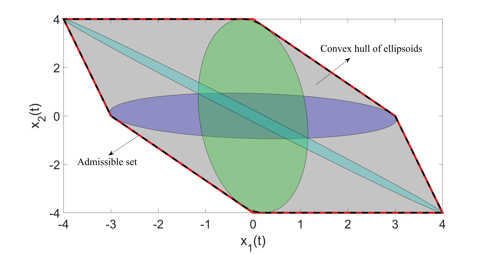
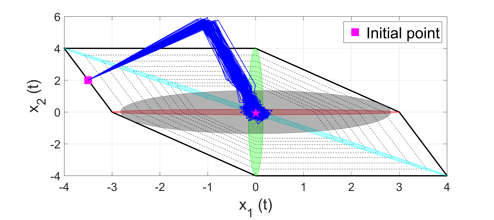
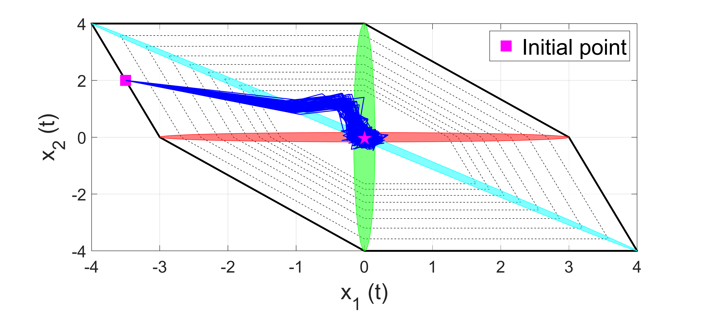
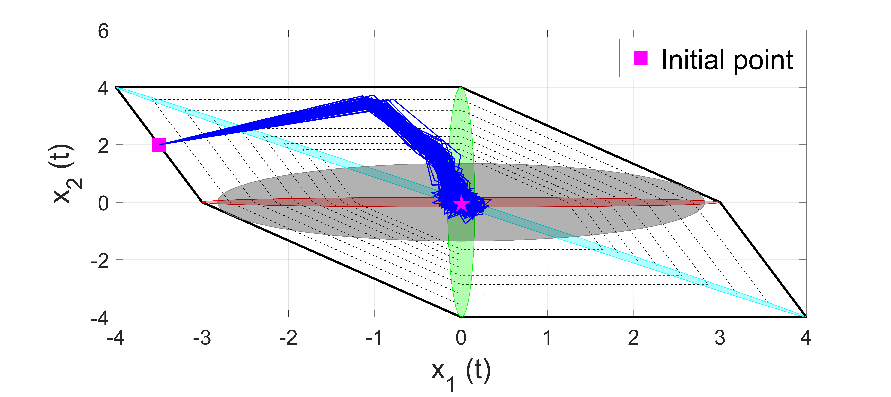

# Risk-Aware Safe Reinforcement Learning for Control of Stochastic Linear Systems

📄 **Title**: Risk-Aware Safe Reinforcement Learning for Control of Stochastic Linear Systems  
📅 **Status**: Accepted (Asian Journal of Control, in press 2025)  
🔗 DOI: *TBA upon publication*

---

## 🧠 Abstract

This paper presents a risk-aware safe reinforcement learning (RL) control design for stochastic discrete-time linear systems. Rather than using a safety certifier to myopically intervene with the RL controller, a risk-informed safe controller is also learned besides the RL controller, and the RL and safe controllers are combined together. Several advantages come along with this approach: 1) High-confidence safety can be certified without relying on a high-fidelity system model and using limited data available, 2) Myopic interventions and convergence to an undesired equilibrium can be avoided by deciding on the contribution of two stabilizing controllers, and 3) highly efficient and computationally tractable solutions can be provided by optimizing over a scalar decision variable and linear programming polyhedral sets. To learn safe controllers with a large invariant set, piecewise affine controllers are learned instead of linear controllers. To this end, the closed-loop system is first represented using collected data, a decision variable, and noise. The effect of the decision variable on the variance of the safe violation of the closed-loop system is formalized. The decision variable is then designed such that the probability of safety violation for the learned closed-loop system is minimized. It is shown that this control-oriented approach reduces the data requirements and can also reduce the variance of safety violations. Finally, to integrate the safe and RL controllers, a new data-driven interpolation technique is introduced. This method aims to maintain the RL agent’s optimal implementation while ensuring its safety within environments characterized by noise. The study concludes with a simulation example that serves to validate the theoretical results.

---

## 🎯 Overview

This repository implements the **risk‑aware safe reinforcement‑learning (RL) framework** introduced in the paper. The method learns **two stabilising controllers in parallel**—an RL policy that maximises reward and a **risk‑informed safe controller** that enforces constraints—and blends their actions through a single, data‑tuned **decision variable**.

**Why it’s different**

1. **High‑confidence safety from limited data**  
   • No high‑fidelity model is required; safety is certified directly from a modest closed‑loop data set.  

2. **No myopic overrides**  
   • Because *both* controllers stabilise the system, adjusting their weights avoids the classic pitfall of hard safety shields that push the state to an undesirable equilibrium.  

3. **Lightweight optimisation**  
   • Safety synthesis reduces to linear programming over polyhedral sets plus a single scalar variable—fast enough for iterative design.  

4. **Large invariant sets**  
   • Instead of a single linear gain, the framework learns **piecewise‑affine** safe controllers, dramatically enlarging the certified safe region.  

5. **Risk‑averse by design**  
   • The decision variable is chosen to minimise the variance (and hence probability) of safety violation under stochastic disturbances.  

6. **Seamless RL–safety interpolation**  
   • A new data‑driven interpolation keeps the RL agent near‑optimal while satisfying the rigorous risk bounds.  

The included MATLAB scripts reproduce the paper’s simulation example, demonstrating that the combined controller tracks the RL optimum when safe, intervenes only as needed, and rigorously bounds the risk of constraint violation.

---

---

## 🛠 Requirements

- **MATLAB R2020a** or newer  
- **YALMIP** & **MOSEK** (for solving SDPs) 

---

## 📸 Visuals

<!-- Part 1 – 1 row × 2 images -->
<table align="center">
  <tr>
    <td></td>
    <td></td>
  </tr>
</table>
<p align="center"><em>Closed-loop Set Partitioning.</em></p>

<!-- Part 2 – 2 images in the first row, 1 image in the second row -->
<table align="center">
  <tr>
    <td></td>
    <td></td>
  </tr>
  <tr>
    <td colspan="2" align="center">
      
    </td>
  </tr>
</table>
<p align="center"><em>Simulation Results.</em></p>


---

## 📜 License & Contact

Released under the MIT License – see `LICENSE` for details.  
Questions or suggestions? Contact: **esmaeil1@msu.edu**

---

## 📚 Citation

If you use this repository, please cite:
```bibtex
@article{esmaeili2025saferl,
  author  = {Esmaeili, Babak and Niknejad, Nariman and Modares, Hamidreza},
  title   = {Risk-Aware Safe Reinforcement Learning for Control of Stochastic Linear Systems},
  journal = {Asian Journal of Control},
  year    = {2025},
  note    = {Accepted, in press}
}
```
